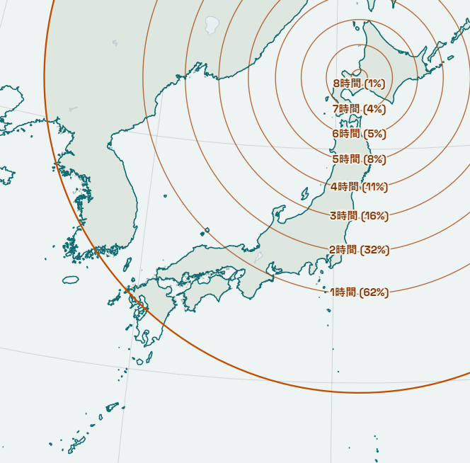
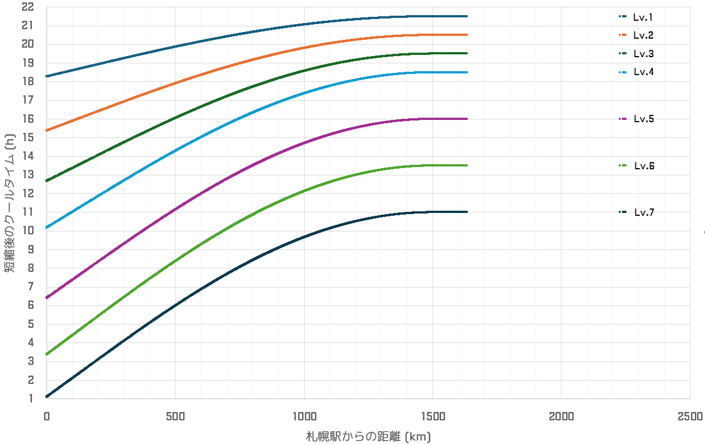

# せいむのクールタイム計算式
せいむのリンク成功時クールタイム減少スキル「点滴石を穿つ」は以下の式によく合致します(誤差1分以内, Lv.2～Lv.5の範囲で確認)。

この式は、

- 札幌駅からの距離が 1500km に近づくにつれてクールタイムの伸びが徐々に小さくなり、1500kmでちょうど伸びが0となるように調整
- 札幌駅近郊では単純な一次関数に比べて1.5倍クールタイムが延長

といった性質があります。

```py
def calc_cool_time(distance_km, ct_max, ct_min):
    """
    distance_km : 札幌までの距離（Haversine の式で算出）
    ct_max      : クールタイムの最大値（時間）
    ct_min      : クールタイムの最小値（時間）
    """
    capped_km = min(distance_km, 1500.0)
    
    dct = ct_max - ct_min
    x2 = capped_km / 1500.0
    return ct_min + dct * x2 + dct*x2*(1-x2)*(1+x2)/2 + dct*x2**2*(1-x2)**2/4 
```

なお、せいむのLv.50(スキルLv.4)時点でのクールタイムの短縮時間は以下のようになります(札幌駅を中心とした正距方位図法)




## 各駅のクールタイム計算値
- Lv.5以降はクールタイム自体は短くなりますが、短縮量の期待値はあまり変化しません
  - 1時間未満の短縮が約30%
  - 2時間以上の短縮が約45%
  - 3時間以上の短縮が約20%
- クールタイム減少時間の期待値は cool, eco は同等、heat は10分程度不利です

### レベルごとのデータ
全駅に対するレベルごとの計算値です
- [点滴石を穿つ Lv.1](seimu_Lv1.csv)
- [点滴石を穿つ Lv.2](seimu_Lv2.csv)
- [点滴石を穿つ Lv.3](seimu_Lv3.csv)
- [点滴石を穿つ Lv.4](seimu_Lv4.csv)
- [点滴石を穿つ Lv.5](seimu_Lv5.csv)
- [点滴石を穿つ Lv.6](seimu_Lv6.csv)
- [点滴石を穿つ Lv.7](seimu_Lv7.csv)

### 全体のデータ
上記をまとめたものです
- [点滴石を穿つ Lv.1-7](seimu.csv)




※ 緯度・経度・属性データは [駅データ](https://github.com/Seo-4d696b75/station_database/blob/main/README.md) (2026/3/31時点) を利用しています。

## 属性ごとのクールタイムの期待値
flat属性は廃駅(unknown)にはアクセスできないため記載していません。短縮時間ごとの必要距離には、n時間以上短縮されるのに必要な距離とその確率を示しています。

## Lv.1
| 属性 | 駅数 | 平均CT (h) | 平均CT (hms) |
| --- | ---: | ---: | --- |
| cool | 3004 | 20.75677 | 20時間45分24秒 |
| eco | 2968 | 20.75801 | 20時間45分29秒 |
| heat | 3020 | 20.83301 | 20時間49分59秒 |

短縮時間ごとの必要距離 (ct_max基準)
| 短縮時間 | 必要距離 | n時間以上短縮される確率 |
| ---: | ---: | ---: |
| 1時間 | 732.553 km | 18% |
| 2時間 | 378.996 km | 8% |
| 3時間 | 69.331 km | 2% |
| 4時間 | 到達不可 | 0% |
| 5時間 | 到達不可 | 0% |
| 6時間 | 到達不可 | 0% |
| 7時間 | 到達不可 | 0% |
| 8時間 | 到達不可 | 0% |

## Lv.2
| 属性 | 駅数 | 平均CT (h) | 平均CT (hms) |
| --- | ---: | ---: | --- |
| cool | 3004 | 19.31889 | 19時間19分8秒 |
| eco | 2968 | 19.32087 | 19時間19分15秒 |
| heat | 3020 | 19.44006 | 19時間26分24秒 |

短縮時間ごとの必要距離 (ct_max基準)
| 短縮時間 | 必要距離 | n時間以上短縮される確率 |
| ---: | ---: | ---: |
| 1時間 | 897.565 km | 46% |
| 2時間 | 632.351 km | 15% |
| 3時間 | 415.221 km | 9% |
| 4時間 | 217.197 km | 4% |
| 5時間 | 24.329 km | 1% |
| 6時間 | 到達不可 | 0% |
| 7時間 | 到達不可 | 0% |
| 8時間 | 到達不可 | 0% |

## Lv.3
| 属性 | 駅数 | 平均CT (h) | 平均CT (hms) |
| --- | ---: | ---: | --- |
| cool | 3004 | 17.92711 | 17時間55分38秒 |
| eco | 2968 | 17.92975 | 17時間55分47秒 |
| heat | 3020 | 18.08847 | 18時間5分18秒 |

短縮時間ごとの必要距離 (ct_max基準)
| 短縮時間 | 必要距離 | n時間以上短縮される確率 |
| ---: | ---: | ---: |
| 1時間 | 980.166 km | 56% |
| 2時間 | 755.127 km | 20% |
| 3時間 | 574.580 km | 13% |
| 4時間 | 414.471 km | 9% |
| 5時間 | 264.867 km | 5% |
| 6時間 | 119.784 km | 3% |
| 7時間 | 到達不可 | 0% |
| 8時間 | 到達不可 | 0% |

## Lv.4
| 属性 | 駅数 | 平均CT (h) | 平均CT (hms) |
| --- | ---: | ---: | --- |
| cool | 3004 | 16.58142 | 16時間34分53秒 |
| eco | 2968 | 16.58463 | 16時間35分5秒 |
| heat | 3020 | 16.77825 | 16時間46分42秒 |

短縮時間ごとの必要距離 (ct_max基準)
| 短縮時間 | 必要距離 | n時間以上短縮される確率 |
| ---: | ---: | ---: |
| 1時間 | 1030.384 km | 62% |
| 2時間 | 828.829 km | 32% |
| 3時間 | 668.673 km | 16% |
| 4時間 | 528.356 km | 11% |
| 5時間 | 399.292 km | 8% |
| 6時間 | 276.760 km | 5% |
| 7時間 | 157.530 km | 4% |
| 8時間 | 38.888 km | 1% |

## Lv.5
| 属性 | 駅数 | 平均CT (h) | 平均CT (hms) |
| --- | ---: | ---: | --- |
| cool | 3004 | 13.78758 | 13時間47分15秒 |
| eco | 2968 | 13.79129 | 13時間47分29秒 |
| heat | 3020 | 14.01455 | 14時間0分52秒 |

短縮時間ごとの必要距離 (ct_max基準)
| 短縮時間 | 必要距離 | n時間以上短縮される確率 |
| ---: | ---: | ---: |
| 1時間 | 1063.269 km | 68% |
| 2時間 | 876.775 km | 44% |
| 3時間 | 729.385 km | 18% |
| 4時間 | 601.091 km | 14% |
| 5時間 | 484.024 km | 10% |
| 6時間 | 373.992 km | 8% |
| 7時間 | 268.302 km | 5% |
| 8時間 | 164.937 km | 4% |

## Lv.6
| 属性 | 駅数 | 平均CT (h) | 平均CT (hms) |
| --- | ---: | ---: | --- |
| cool | 3004 | 11.16659 | 11時間10分0秒 |
| eco | 2968 | 11.17050 | 11時間10分14秒 |
| heat | 3020 | 11.40597 | 11時間24分22秒 |

短縮時間ごとの必要距離 (ct_max基準)
| 短縮時間 | 必要距離 | n時間以上短縮される確率 |
| ---: | ---: | ---: |
| 1時間 | 1074.936 km | 72% |
| 2時間 | 893.729 km | 46% |
| 3時間 | 750.772 km | 19% |
| 4時間 | 626.594 km | 14% |
| 5時間 | 513.566 km | 11% |
| 6時間 | 407.651 km | 9% |
| 7時間 | 306.298 km | 6% |
| 8時間 | 207.647 km | 4% |

## Lv.7
| 属性 | 駅数 | 平均CT (h) | 平均CT (hms) |
| --- | ---: | ---: | --- |
| cool | 3004 | 8.71845 | 8時間43分6秒 |
| eco | 2968 | 8.72227 | 8時間43分20秒 |
| heat | 3020 | 8.95251 | 8時間57分9秒 |

短縮時間ごとの必要距離 (ct_max基準)
| 短縮時間 | 必要距離 | n時間以上短縮される確率 |
| ---: | ---: | ---: |
| 1時間 | 1070.052 km | 71% |
| 2時間 | 886.634 km | 45% |
| 3時間 | 741.827 km | 19% |
| 4時間 | 615.935 km | 14% |
| 5時間 | 501.229 km | 11% |
| 6時間 | 393.608 km | 8% |
| 7時間 | 290.465 km | 6% |
| 8時間 | 189.877 km | 4% |