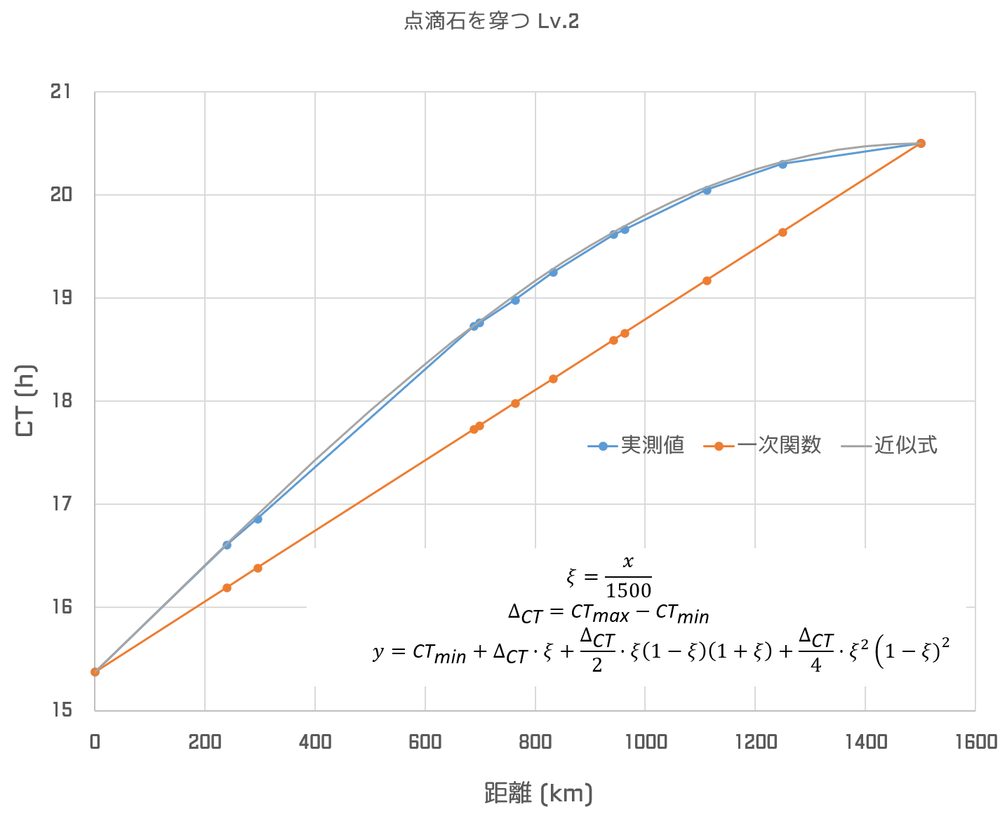
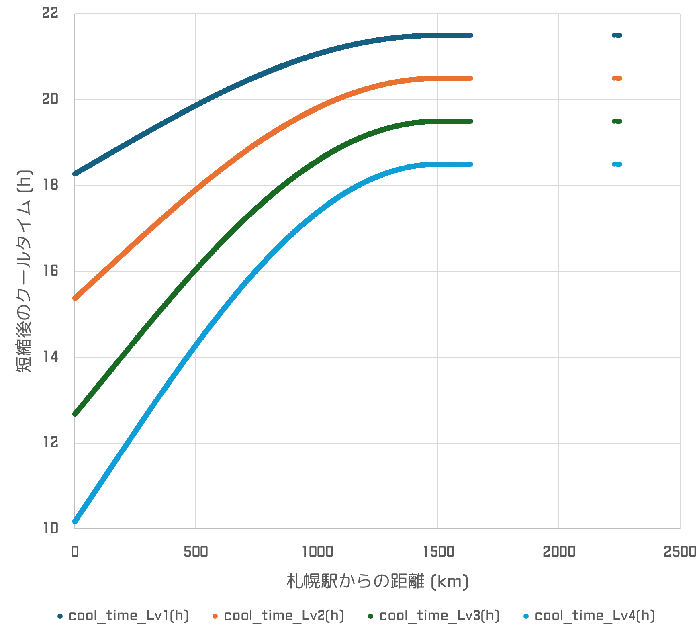

# せいむのクールタイム計算式
点滴石を穿つLv1～4は以下の式によく合致します(誤差1分以内)。

この式は、

- 札幌駅からの距離が 1500km に近づくにつれてクールタイムの伸びが徐々に小さくなり、1500kmでちょうど伸びが0となるように調整
- 札幌駅近郊では単純な一次関数に比べて1.5倍クールタイムが延長

といった性質があります。

```py
def calc_cool_time(distance_km, ct_max, ct_min):
    """
    distance_km : 札幌までの距離（Haversine の式で算出）
    ct_max      : クールタイムの最大値（時間）
    ct_min      : クールタイムの最小値（時間）
    """
    capped_km = min(distance_km, 1500.0)
    
    dct = ct_max - ct_min
    x2 = capped_km / 1500.0
    return ct_min + dct * x2 + dct*x2*(1-x2)*(1+x2)/2 + dct*x2**2*(1-x2)**2/4 
```
Lv5以降は異なる式のようです(要検証)。

## 各駅のクールタイム計算値
### レベルごと
- [点滴石を穿つ Lv.1](station_Lv1.csv)
- [点滴石を穿つ Lv.2](station_Lv2.csv)
- [点滴石を穿つ Lv.3](station_Lv3.csv)
- [点滴石を穿つ Lv.4](station_Lv4.csv)



### 全体
- [点滴石を穿つ Lv.1-4](station.csv)




※ 緯度・経度データは [駅データ](https://github.com/Seo-4d696b75/station_database/blob/main/README.md) を利用しています。

## 属性ごとのクールタイムの期待値
flat属性は廃駅(unknown)にはアクセスできないため参考値です。

## Lv1
| 属性 | 駅数 | 平均CT (h) | 平均CT (hms) |
| --- | ---: | ---: | --- |
| cool | 3004 | 20.75677 | 20時間45分24秒 |
| eco | 2969 | 20.75729 | 20時間45分26秒 |
| heat | 3021 | 20.83232 | 20時間49分56秒 |
| unknown | 378 | 19.89805 | 19時間53分53秒 |

## Lv2
| 属性 | 駅数 | 平均CT (h) | 平均CT (hms) |
| --- | ---: | ---: | --- |
| cool | 3004 | 19.31889 | 19時間19分8秒 |
| eco | 2969 | 19.31972 | 19時間19分11秒 |
| heat | 3021 | 19.43895 | 19時間26分20秒 |
| unknown | 378 | 17.95426 | 17時間57分15秒 |

## Lv3
| 属性 | 駅数 | 平均CT (h) | 平均CT (hms) |
| --- | ---: | ---: | --- |
| cool | 3004 | 17.92711 | 17時間55分38秒 |
| eco | 2969 | 17.92821 | 17時間55分42秒 |
| heat | 3021 | 18.08700 | 18時間5分13秒 |
| unknown | 378 | 16.10982 | 16時間6分35秒 |

## Lv4
| 属性 | 駅数 | 平均CT (h) | 平均CT (hms) |
| --- | ---: | ---: | --- |
| cool | 3004 | 16.58142 | 16時間34分53秒 |
| eco | 2969 | 16.58276 | 16時間34分58秒 |
| heat | 3021 | 16.77645 | 16時間46分35秒 |
| unknown | 378 | 14.36472 | 14時間21分53秒 |
